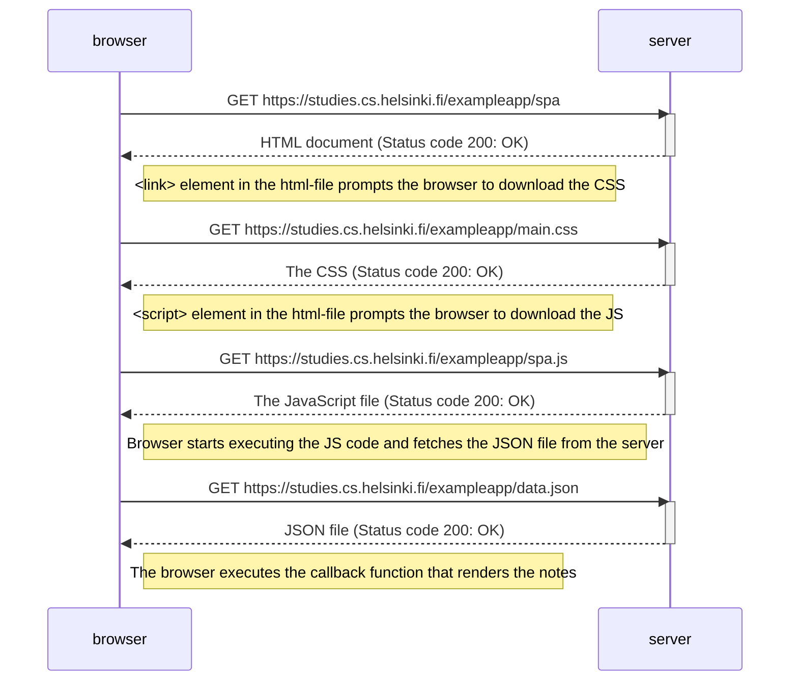

```mermaid
   sequenceDiagram
    participant browser
    participant server
    
    browser->>server: GET https://studies.cs.helsinki.fi/exampleapp/spa
    activate server
    server-->>browser: HTML document (Status code 200: OK)
    deactivate server

    Note right of browser: <link> element in the html-file prompts the browser to download the CSS
    
    browser->>server: GET https://studies.cs.helsinki.fi/exampleapp/main.css
    activate server
    server-->>browser: The CSS (Status code 200: OK)
    deactivate server
    
    Note right of browser: <script> element in the html-file prompts the browser to download the JS

    browser->>server: GET https://studies.cs.helsinki.fi/exampleapp/spa.js
    activate server
    server-->>browser: The JavaScript file (Status code 200: OK)
    deactivate server    
    
    Note right of browser: Browser starts executing the JS code and fetches the JSON file from the server 
        
    browser->>server: GET https://studies.cs.helsinki.fi/exampleapp/data.json
    activate server
    server-->>browser: JSON file (Status code 200: OK)
    deactivate server    

    Note right of browser: The browser executes the callback function that renders the notes

``` 