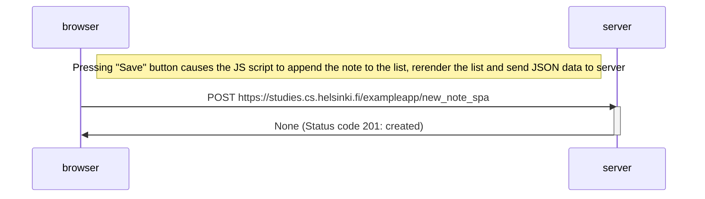

```mermaid
   sequenceDiagram
    participant browser
    participant server

    Note right of browser: Pressing "Save" button causes the JS script to append the note to the list, rerender the list and send JSON data to server
    
    browser->>server: POST https://studies.cs.helsinki.fi/exampleapp/new_note_spa
    activate server
    server->>browser: None (Status code 201: created)
    deactivate server

``` 